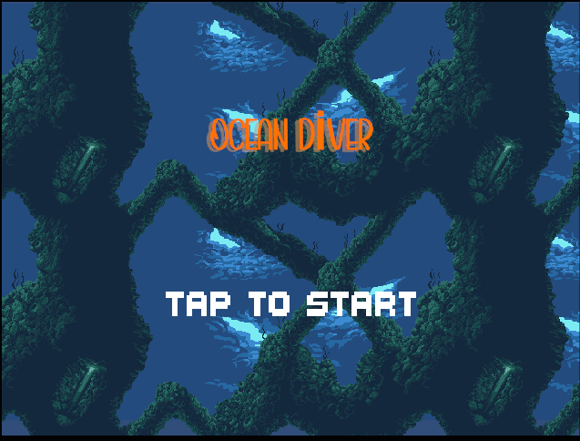
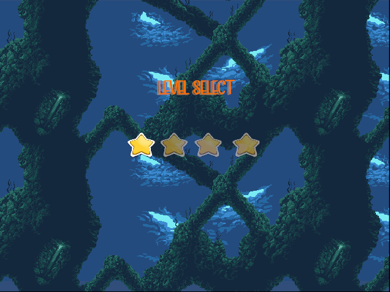
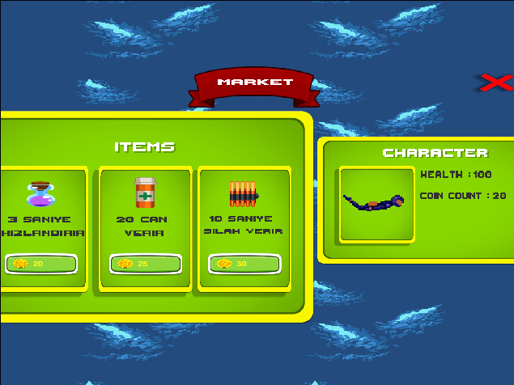
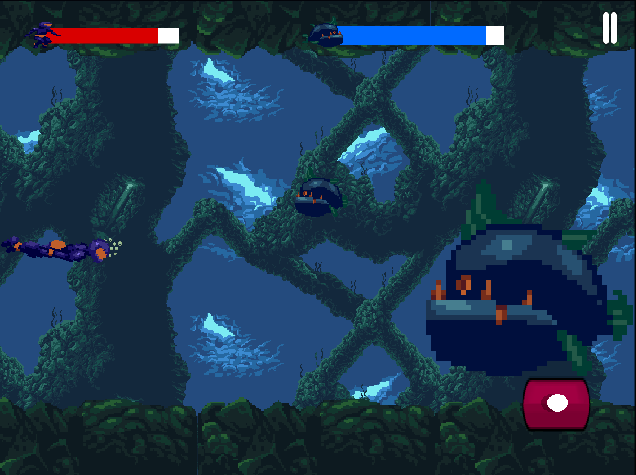
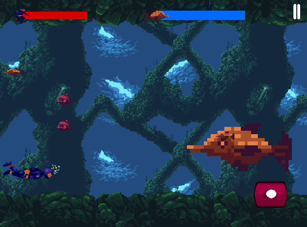
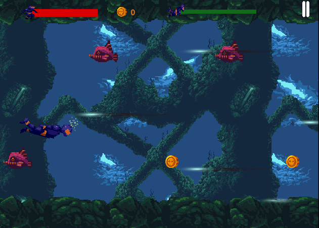

# 🌊 Ocean Diver 🐠

**Ocean Diver**, derin denizlerin gizemli dünyasında geçen, heyecan dolu bir 2D yan kaydırmalı aksiyon-macera oyunudur!  
Oyuncu, otomatik sağa kayan karakteri kontrol ederek zorlu engellerden ve düşman deniz canlılarından kaçmak, altınları toplayarak puanını artırmak zorundadır.

---

## 🎮 Oynanış

- 🚀 **Otomatik İlerleme:** Karakter sürekli sağa doğru hareket eder. Oyuncu, dokunmatik ekranı kullanarak karakteri yukarı zıplatır veya özel güçlerle engellerden kaçar.  
- 🐟 **Çeşitli Düşmanlar:** Balıklar, deniz anaları ve diğer tehlikeli canlılar oyuncunun yolunu keser. Temasta sağlık azalır.  
- 💰 **Altın Toplama:** Her seviyede altınlar toplanabilir. Toplanan altınlar `PlayerPrefs` kullanılarak saklanır.  
- 🛒 **Market Sistemi:** Toplanan altınlarla marketten güçlendirmeler veya kozmetikler satın alınabilir.  
- 🐙 **Zorlu Patron Savaşları:** Her seviyenin sonunda farklı mekaniklere sahip dev patronlar bulunur.  
- 📱 **Mobil Uyumluluk:** Android ve iOS cihazlar için optimize edilmiştir. Dokunmatik kontrollere tam uyum sağlar.

---

## 🖼️ Ekran Görüntüleri

Aşağıda oyuna ait bazı ekran görüntülerini bulabilirsiniz:

| Ana Menü | Leveller | Market |
|---------|---------|--------|
|  |  |  |

| Boss Savaşı  1 | Boss Savaşı  2 | Level 1 |
|-------------|----------------|--------------------------|------------|
|  |  |  |

> 📸 Not: `screenshots/` klasörüne görsellerinizi aynı isimlerle eklemeyi unutmayın!

---

## ⚙️ Teknik Özellikler

- 🎮 Unity 2D oyun motoru kullanıldı  
- 💻 C# ile yazılmış optimize oyun mekaniği  
- 🎞️ Rigidbody2D, Animator ve Particle System ile animasyon ve efekt desteği  
- 🧠 `PlayerPrefs` kullanılarak oyuncu verileri (altın, alışveriş geçmişi vb.) kaydedildi  
- 🧱 Modüler ve ölçeklenebilir kod yapısı  
- 📱 Dokunmatik cihazlara uyumlu arayüz ve kontroller

---

## 🚀 Projeyi Deneyin

Projeyi indirip Unity Editor ile açarak doğrudan deneyebilir veya build alarak mobil cihazda test edebilirsiniz.

---

## 🎯 Neden Ocean Diver?

Bu projeyle şunları başardım:

- Oyun tasarımı, seviye kurgusu ve mobil kontrolleri entegre etme  
- Jetpack benzeri mekanikler ve zıplama sistemleri geliştirme  
- Oyun içi market ve kaynak yönetim sistemi kurma (`PlayerPrefs`)  
- Boss AI ve zorluk dengesi üzerine çalışma  
- Görsel ve ses entegrasyonu ile oyun deneyimini zenginleştirme

---

## 📩 İletişim

Projeyle ilgili her türlü soru, geri bildirim veya iş birliği için iletişime geçmekten çekinmeyin!

---

**Teşekkürler!** 🙏  
*Ocean Diver ile su altı dünyasında eğlenceye dalın!* 🐬🌊
